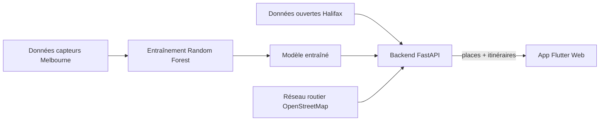

# 🅿️ ZoPark — Stationnement intelligent à Halifax

**Trouver une place au centre-ville et s'y rendre par les rues les moins saturées, sans aucun capteur dans la rue.**

🇬🇧 [English version](README.md)

---

## Le problème

Halifax publie l'emplacement de ses bornes de stationnement, mais rien n'indique si une place est probablement libre. Les villes qui répondent à cette question installent des capteurs dans la chaussée, ce qui coûte cher. Halifax n'en a pas.

## La solution

Melbourne, en Australie, publie les données réelles de ses capteurs de rue. J'ai entraîné un modèle **Random Forest** sur ces données pour apprendre comment l'occupation varie selon l'heure et le jour, puis je l'ai **transféré aux données ouvertes de Halifax**. Résultat : une estimation de l'occupation pour chaque place réglementée du centre-ville, sans aucun matériel.

## Fonctionnalités clés

- 🗺️ **Carte interactive** de 391 places réglementées (176 bornes de paiement et 215 places accessibles)
- 📊 **Prédiction de l'occupation** de chaque place selon le moment de la journée
- 🚫 **Zones interdites** et restrictions affichées sur la carte
- 🧭 **Itinéraire qui évite la congestion** : un algorithme **A\*** pondéré sur le vrai réseau routier de Halifax, affiché à côté du plus court chemin classique

## Architecture

## Résultats

| Modèle | AUC |
|---|---|
| Baseline (moyenne historique) | 0,705 |
| **Random Forest** | **0,721** |

Entraîné sur 2 M d'événements réels, testé sur des mois jamais vus. L'heure explique l'essentiel du signal : le prochain gain viendra des **variables spatiales**.

## Ce que j'ai réalisé

- **API REST** en FastAPI qui fournit les places, les prédictions et les itinéraires
- **Routage A\* pondéré** sur un graphe OSMnx / NetworkX, avec un coût `distance × (1 + α × occupation)`
- **Script d'entraînement** du modèle et comparaison avec une baseline simple
- **Pipeline de données** qui regroupe les jeux de données ouverts de Halifax en un seul fichier JSON
- **Interface Flutter Web** avec carte interactive
- **Exécutable Windows autonome** empaqueté avec PyInstaller

## Technologies

**Backend :** Python · FastAPI · Uvicorn  
**Apprentissage automatique :** scikit-learn · pandas  
**Routage :** OSMnx · NetworkX  
**Frontend :** Flutter Web · flutter_map · OpenStreetMap  
**Distribution :** PyInstaller · PowerShell

## Limites connues

- Seul le stationnement **réglementé** est couvert : Halifax ne publie aucune donnée sur le stationnement gratuit sur rue.
- Les variables du modèle sont surtout temporelles, donc des places voisines ont souvent le même score.
- Les prédictions sont validées sur Melbourne.

## Prochaines étapes

- Ajouter des variables spatiales (commerces, bureaux, hôpitaux) pour mieux distinguer les places
- Valider les prédictions avec des observations réelles à Halifax
-déploier l'application dans d'autres villes
---

## Code source

Le code source complet est conservé dans un **dépôt privé**, car le projet est toujours en développement. **Accès sur demande** : écris-moi sur [LinkedIn]((https://www.linkedin.com/in/yassine-elanaoui-77384129a/)).

## Remerciements

Projet réalisé dans le cadre d'un stage supervisé à l'**Université de Moncton**, sous la supervision du **professeur Zoubeir Mlika**.  
Lin et al., « A survey of smart parking solutions », IEEE Transactions on Intelligent Transportation Systems, 2017

**Données :** City of Melbourne Open Data · Halifax Regional Municipality Open Data · © contributeurs OpenStreetMap

## Auteur

**Yassine Elanaoui** · Étudiant en informatique appliquée, Université de Moncton (promotion 2027)  
[LinkedIn]((https://www.linkedin.com/in/yassine-elanaoui-77384129a/)) · [Courriel](yelanaoui@gmail.com)
