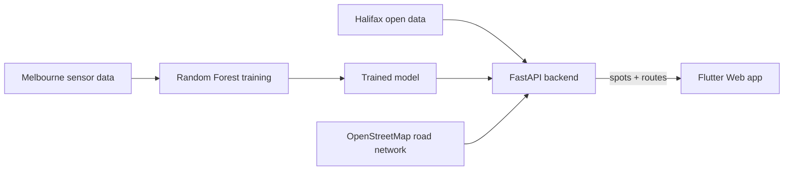

# 🅿️ ZoPark — Smart Street Parking for Halifax

**Find a parking spot downtown and get there through the least congested streets, without a single street sensor.**

🇫🇷 [Version française](README.fr.md)

---

## The problem

Downtown Halifax publishes where its parking meters are, but not whether a spot is likely to be free. Cities that answer that question install sensors in the pavement, which is expensive. Halifax has none.

## The solution

Melbourne, Australia, publishes real sensor data from its streets. I trained a **Random Forest** model on that data to learn how parking occupancy changes with time and day, then **transferred it to Halifax's open municipal data**. The result is an occupancy estimate for every regulated spot downtown, with no hardware at all.

## Key features

- 🗺️ **Interactive map** of 391 regulated spots (176 pay meters and 215 accessible spots)
- 📊 **Occupancy prediction** for each spot, based on 5 variables 
- 🚫 **No-parking zones** and restrictions shown on the map
- 🧭 **Congestion-aware routing**: a custom weighted **A\*** algorithm on the real Halifax road network, shown side by side with the classic shortest path

## Architecture

## Results

| Model | AUC |
|---|---|
| Baseline (historical average) | 0.705 |
| **Random Forest** | **0.721** |

Trained on 2M real sensor events, tested on unseen months. Time of day drives most of the signal, so the next gain will come from **spatial features**.

## What I built

- **REST API** in FastAPI serving parking data, predictions and routes
- **Weighted A\* routing** on an OSMnx / NetworkX graph, with a cost of `distance × (1 + α × occupancy)`
- **Model training script** and a comparison against a simple baseline
- **Data pipeline** turning Halifax open datasets into a single JSON bundle
- **Flutter Web interface** with an interactive map
- **Standalone Windows executable** packaged with PyInstaller

## Tech stack

**Backend:** Python · FastAPI · Uvicorn  
**Machine learning:** scikit-learn · pandas  
**Routing:** OSMnx · NetworkX  
**Frontend:** Flutter Web · flutter_map · OpenStreetMap  
**Packaging:** PyInstaller · PowerShell

## Known limitations

- Only **regulated** parking is covered: Halifax publishes no data on free street parking.
- Predictions are validated on Melbourne data; no local Halifax data exists yet to validate them.

## Next steps

- Add spatial features (nearby shops, offices, hospitals) to better separate spots
- Validate predictions with real observations in Halifax
- do it in other cities like Montreal Toronto New-York...
---

## Source code

The full source code is kept in a **private repository** while the project is still in development. **Access is available on request**: contact me on [LinkedIn](https://www.linkedin.com/in/yassine-elanaoui-77384129a/).

## Credits

-Developed as a supervised internship project at **Université de Moncton**, under the supervision of **Prof. Zoubeir Mlika**.  
-Lin et al., « A survey of smart parking solutions », IEEE Transactions on Intelligent Transportation Systems, 2017

**Data:** City of Melbourne Open Data · Halifax Regional Municipality Open Data · © OpenStreetMap contributors

## Author

**Yassine Elanaoui** · Applied Computer Science student, Université de Moncton (class of 2027)  
[LinkedIn]([https://linkedin.com/in/YOUR_PROFILE](https://www.linkedin.com/in/yassine-elanaoui-77384129a/)) · [Email](yelanaoui@gmail.com)
